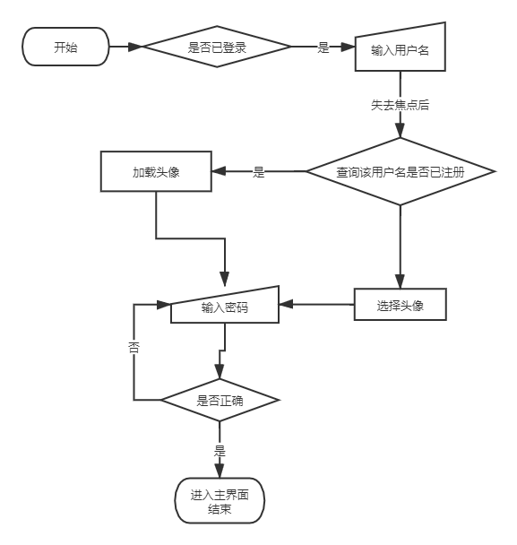

# 帮你执行各种复杂耗时操作——盖楼大师

## 成员信息

​	15352289 石超龙

## 简介

​		当代社会存在一群羊毛党，他们会为了几块钱甚至几毛钱的红包而开心好久。这一群体背后，存在的社会问题以及心理因素我们不去讨论。这里重点讨论的是，这几块钱几毛钱的红包背后，是羊毛党大量消耗的时间与精力。作为一名资深羊毛党，我虽然热爱褥羊毛，但在学业的压力下，仅剩的褥羊毛的时间也岌岌可危。为了提高褥羊毛的效率，打击资本主义的贪婪态度，我开发了这款App。

## 开发环境

- **操作系统**：Windows10
- **IDE**：Android Studio

## 成员分工

- **石超龙**：负责UI设计，无障碍服务操作功能相关的代码编写及封装，注册登录模块，数据库模块，与服务器交互等

## 重点&难点

### 1.UI部分

​	BottomNavigationView、ViewPager的使用，RecyclerView、Fragment的使用

### 2.登录与注册

​	登录与注册逻辑，与服务器交互并进行验证。用户登录时自动加载头像。

### 3.数据库

​	通过数据库将本地任务信息保存

### 4.无障碍服务

​	通过无障碍服务执行自动操作，使用无障碍服务获取手机状态信息

## 功能信息

1. 登录、注册与注销
2. 任务列表的加载
3. 界面切换，滑动与显示
4. 无障碍服务的注册，检查与开启
5. 基于无障碍服务的自动任务的执行
6. 基于Operation包构建各类自动化服务

## 实现方法

1. ### 登录、注册与注销

   登录与注册流程图：

   

   ​	这里依照流程图的顺序进行说明。

   ​	首先是判断用户是否已登录，我在SharedPreferences中保存一个名为username的String类型变量，用于保存登录状态下的用户名。如未登录，则将其保存为空字符串。在每次启动app时，检查本地username数据，判断登录状态。具体代码如下：

   ```java
   public static boolean isLogined(Context context){
       SharedPreferences preferences = context.getSharedPreferences("BuildingMaster",MODE_PRIVATE);
       String id=preferences.getString("username","");
       return !id.isEmpty();
   }
   ```

   ​	在用户未登录状态下，进入登录注册界面，用户首先输入用户名，失去焦点后，app将响应失去焦点的状态，读取用户名，上传服务器，如用户名存在，则读取服务器中的头像数据，加载在界面的ImageView中。

   ​	焦点状态监控及处理代码如下：

   ```java
   usernameEditText.setOnFocusChangeListener(new View.OnFocusChangeListener() {
       @Override
       public void onFocusChange(View v, boolean hasFocus) {
           if (!hasFocus){
               LoginModule.isRegisted(usernameEditText.getText().toString(),head,activity);
           }
       }
   });
   ```

   ​	登录模块所有与服务器交互的操作都封装在LoginModule模块中，服务端直接使用LeanCloud提供的云端存储服务。下列函数列出了，向服务器查询用户名是否存在过程中的操作。AVQuery，AVObject是leanCloud提供的相关sdk中的对象。查询返回结果，如果数量为0，则切换注册状态，反之获取头像并加载。注册状态下，ImageView可点击，用于上传头像图片，而登录状态下，头像图片不可点击。

   ```java
   public static void isRegisted(String username, final ImageView head, final LoginActivity activity, final View.OnClickListener listener){
       AVQuery<AVObject> o = new AVQuery<>("UserInfo");
       o.whereEqualTo("username",username);
       o.getFirstInBackground().subscribe(new Observer<AVObject>() {
           @Override
           public void onSubscribe(Disposable d) {}
   
           @Override
           public void onNext(AVObject avObject) {
               getHead(avObject.getAVFile("head"),head,activity);
               head.setClickable(true);
               head.setOnClickListener(listener);
           }
   
           @Override
           public void onError(Throwable e) {
               head.setClickable(false);
           }
   
           @Override
           public void onComplete() {}
       });
   }
   ```

   ​	以下是从服务器获取头像数据的代码。

   ```java
   public static void getHead(AVFile file, final ImageView view, final LoginActivity activity){
       Glide.with(activity).asBitmap().load(file.getUrl()).into(new SimpleTarget<Bitmap>() {
           @Override
           public void onResourceReady(@NonNull Bitmap resource, @Nullable Transition<? super Bitmap> transition) {
               String s = Base64Helper.BitMapToBase64(resource);
               Bitmap map = Base64Helper.Base64ToBitMap(s);
               view.setImageBitmap(map);
           }
       });
   }
   ```

   ​	从获取到的对象中取得图像url，然后通过Glide加载图片并显示在ImageView中。同时，由于后续还有展示头像的需要，这里将图片Bitmap数据转换为Base64编码，然后存储在SharedPreferences中。

   ​	当查询到的用户名为空时，切换登录状态，用户可以通过点击头像图标的方式设置自己的头像，代码如下：

   ```java
   listener = new View.OnClickListener() {
       @Override
       public void onClick(View v) {
           Intent intent=new Intent();
           intent.setType("image/*");
           intent.setAction(Intent.ACTION_GET_CONTENT);
           startActivityForResult(intent, 1023);
       }
   };
   ```

   ​	以下是打开图库后的回调函数，用于获取选择的图片。

   ```java
   @Override
   public void onActivityResult(int requestCode, int resultCode, Intent data) {
       if(requestCode==1023){
           Uri uri = data.getData();
           try {
               Bitmap bitmap = BitmapFactory.decodeStream(activity.getContentResolver().openInputStream(uri));
               head.setImageBitmap(bitmap);
           } catch (FileNotFoundException e) {}
       }
       super.onActivityResult(requestCode, resultCode, data);
   }
   ```

   设置完图片，输入密码，点击登录按钮，在判断输入用户名密码不为空的情况下，进行登录、注册操作。

   以下为注册部分代码：

   ```java
   public static void registe(final User user, final LoginActivity activity){
       final AVObject o = new AVObject("UserInfo");
       o.put("username",user.username);
       o.put("password",user.password);
       AVFile file = new AVFile("head.jpg", BitmapHelper.BitmapToBytes(user.head));
       o.put("head",file);
       file.saveInBackground(new ProgressCallback() {
           @Override
           public void done(Integer percentDone) {
               if (percentDone == 100){
                   o.saveInBackground().subscribe(new Observer<AVObject>() {
                       @Override
                       public void onSubscribe(Disposable d) {}
   
                       @Override
                       public void onNext(AVObject avObject) {
                           SharePreferenceUtil.setData(activity.getApplicationContext(),"username",user.username);
                           SharePreferenceUtil.setData(activity.getApplicationContext(),"head",Base64Helper.BitMapToBase64(user.head));
                           activity.startActivity(new Intent(activity.getBaseContext(), MainActivity.class));
                           activity.finish();
                       }
   
                       @Override
                       public void onError(Throwable e) {}
   
                       @Override
                       public void onComplete() {}
                   });
               }
           }
       });
   }
   ```

   ​	由于需要将头像也上传至服务器，因此需要将图片转换为字节流数据，当图片上传完成后，上传用户名密码等数据，上传成功后，将用户名和经过Base64编码的头像保存在SharedPreferences中，并启动Intent进入主界面。

   ​	登录部分逻辑较为简单，这里不做过多介绍。

2. ### 任务列表的加载

   ​	任务列表的加载分为两部分，本地任务列表的加载和服务器上任务列表的加载。

   ​	整个任务列表的加载均在开屏页面展示过程中进行，从而减少主界面显示的卡顿。

   ​	两个列表均使用RecyclerView，代码中，TaskContent为本地任务列表的数据源类，OnlineTaskContent为网络任务列表的数据源类，两个列表有各自的Adapter但共用同一个Item布局。

   ​	列表的数据项对象为TaskItem，其拥有的成员变量有：

   ```java
   String id;
   String title;
   String description;
   int star_count;
   boolean isStar;
   String author_name;
   String author_head;
   String info;	//存储自动化操作过程信息数据，OperationBuilder对象序列化后的数据
   ```

   这里对象的序列化使用JSON格式，配合GSON进行生成与解析。

   网络任务列表将从云端读取任务列表，每次读取10条。

   ```java
   public static void initData(){
       AVQuery<AVObject> query = new AVQuery<>("Tasks");
       query.limit(10);
       query.findInBackground().subscribe(new Observer<List<AVObject>>() {
           @Override
           public void onSubscribe(Disposable d) {}
   
           @Override
           public void onNext(List<AVObject> avObjects) {
               for (AVObject o : avObjects){
                   TaskItem item = new TaskItem(o.getObjectId(),o.getString("title"),o.getString("description"),o.getInt("starCount"),o.getString("authorName"),false,o.getString("authorHead"),o.getString("detail"));
                   addItem(item);
               }
           }
   
           @Override
           public void onError(Throwable e) {}
   
           @Override
           public void onComplete() {}
       });
   }
   ```

   ​	而本地任务列表则会从本地的数据库中读取任务列表，数据库操作使用的是Room。数据库的存取操作与RxJava相结合。主要操作如下：

   ```java
   @Dao
   public interface TaskDao {
       @Insert (onConflict = OnConflictStrategy.IGNORE)
       Completable insertTask(TaskItem item);
   
       @Update
       Completable updateTask(TaskItem item);
   
       @Query("SELECT * FROM tasks")
       Single<List<TaskItem>> getTasks();
   
       @Delete
       Completable deleteTask(TaskItem item);
   }
   ```

   ​	读取成功后加载进数据源中即可。

   ​	另外，本地任务列表支持删除功能，长按列表项，即可进行删除操作，删除操作会同时删除本地数据库的数据项。

   ```java
   public static void unStar(final String id, final TaskItemRecyclerViewAdapter adapter){
       TaskDatabase.getInstance(null).getDao().deleteTask(ITEM_MAP.get(id))
           .subscribeOn(Schedulers.io())
           .subscribe(new CompletableObserver() {
               @Override
               public void onSubscribe(@NonNull Disposable d) {}
   
               @Override
               public void onComplete() {
                   Log.i(TAG,"Delete local data success.");
                   ITEMS.remove(ITEM_MAP.get(id));
               }
   
               @Override
               public void onError(@NonNull Throwable e) {}
           });
   }
   ```

   ​	网络任务列表项中，点击收藏图标即可收藏该任务到本地，同时收藏数量加一，加一的信息同样会被同步到服务器上，本地任务列表删除列表项时，收藏数会减一，网络任务列表项的收藏图标也会变回为未收藏。因此，可以看出，两个列表项互相之间影响较大，为了保证其能实时刷新，我在adapter创建阶段便使其互相持有对方的引用。某列表项更改状态后，更改两边的数据源，并同时刷新两边列表，即可实现两个列表同步显示。

   ​	以下为本地任务列表，确认删除该项时的操作。

   ```java
   builder.setPositiveButton("确定", new DialogInterface.OnClickListener() {
       @Override
       public void onClick(DialogInterface dialog, int which) {
           OnlineTaskContent.ITEM_MAP.get(mValues.get(position).id).star_count -= 1;	//更改网络任务列表数据数据源
           NetModule.changeStarCount(mValues.get(position).id,-1);  //将收藏数信息同步到服务器
           TaskContent.unStar(mValues.get(position).id,TaskItemRecyclerViewAdapter.this);	//执行数据库的删除操作
           Toast.makeText(holder.mView.getContext(),"已删除该任务。",Toast.LENGTH_LONG).show();
           notifyDataSetChanged();		//刷新本地列表
           adapter.notifyDataSetChanged();		//刷新网络任务列表
       }
   });
   ```

   ​	以下为网络任务列表添加任务为收藏时的操作：

   ```java
   holder.stars.setOnClickListener(new View.OnClickListener() {
       @Override
       public void onClick(View v) {
           if (TaskContent.ITEMS.size()== 0 || TaskContent.ITEM_MAP.get(mValues.get(position).id) == null){  //判断本地是否已收藏
               mValues.get(position).star_count += 1;    //更改自己的数据源
               TaskContent.addItem(mValues.get(position),holder.mView.getContext());    //添加到本地列表的数据源
               Toast.makeText(holder.mView.getContext(),"已将该任务添加至本地。",Toast.LENGTH_LONG).show();
               holder.stars.setImageResource(R.drawable.star_true);   //更改列表收藏状态	
               notifyItemChanged(position);   //刷新自身列表
               adapter.notifyDataSetChanged();   //刷新本地列表
               NetModule.changeStarCount(mValues.get(position).id,1);  //将收藏数同步到服务器
           }
       }
   });
   ```

3. ### 界面切换，滑动与显示

   ​	整个主界面部分由BottomNavigationView和ViewPager部分构成。

   ​	BottomNavigationView的点击操作需要切换ViewPager的界面，ViewPager的滑动操作也需要切换BottomNavigationView的选中状态。设置ViewPager还需要一个FragmentStateAdapter来设置Fragments。整体而言并不复杂，故这里不做赘述。

4. ### 无障碍服务的注册，检查与开启

   ​	无障碍服务的使用需要注册，注册需要在Manifest中，并且有相应的参数配置文件。如下：

   ​	Manifest中的配置：

   ```xml
   <service
       android:name=".Service.BuildingService"
       android:label="@string/building_service_label"
       android:permission="android.permission.BIND_ACCESSIBILITY_SERVICE">
       <intent-filter>
           <action android:name="android.accessibilityservice.AccessibilityService" />
       </intent-filter>
   
       <meta-data
           android:name="android.accessibilityservice"
           android:resource="@xml/building_service_config" />
   </service>
   ```

   ​	参数配置文件：

   ```xml
   <accessibility-service xmlns:android="http://schemas.android.com/apk/res/android"
       android:description="@string/building_service_description"
       android:accessibilityEventTypes="typeAllMask"
       android:accessibilityFlags="flagDefault"
       android:accessibilityFeedbackType="feedbackAllMask"
       android:notificationTimeout="100"
       android:canRetrieveWindowContent="true"
       android:canPerformGestures="true"
       android:packageNames="com.tencent.mm"
   />
   ```

   ​	检查应用自身的无障碍服务是否开启，需要执行两次判断。

   ​	首先判断系统无障碍服务功能是否已开启。

   ```java
   public static boolean isAccessibilitySettingsOn(Context context) {
       AccessibilityManager manager = (AccessibilityManager)context.getSystemService(ACCESSIBILITY_SERVICE);
       return manager.isEnabled();
   }
   ```

   ​	通过获取AccessibilityManager来判断无障碍功能是否开启。但这部分无法判断具体开启的无障碍服务项，因此需要获取具体的正在运行的无障碍服务的名称来判断是否正在运行。

   ```java
   private static boolean isAccessibilitySettingsOn(Context context, String service) {
       TextUtils.SimpleStringSplitter mStringColonSplitter = new TextUtils.SimpleStringSplitter(':');
       String settingValue = Settings.Secure.getString(
           context.getApplicationContext().getContentResolver(),
           Settings.Secure.ENABLED_ACCESSIBILITY_SERVICES);
       if (settingValue != null) {
           mStringColonSplitter.setString(settingValue);
           while (mStringColonSplitter.hasNext()) {
               String accessibilityService = mStringColonSplitter.next();
               if (accessibilityService.equalsIgnoreCase(service)) {
                   return true;
               }
           }
       }
       return false;
   }
   ```

   ​	盖楼大师的无障碍服务名为：

   ```java
   private static final String SERVICE_NAME = "cn.edu.sysu.buildingmaster/cn.edu.sysu.buildingmaster.Service.BuildingService";
   ```

   ​	判断其位于正在运行的无障碍服务列表中时，即可继续操作，否则，则需要跳转到无障碍服务的设置页面，由用户手动开启该服务。

   ```java
   private static void startSetting(Context context){
       Toast.makeText(context, "请手动打开相关的无障碍服务", Toast.LENGTH_SHORT).show();
       Intent accessibleIntent = new Intent(Settings.ACTION_ACCESSIBILITY_SETTINGS);
       context.startActivity(accessibleIntent);
   }
   ```

   ​	手动开启服务后，可重写AccessibilityService的onServiceConnected方法，来执行跳转会应用主界面的操作。

   ```java
   public void startMain(){
       Intent intent = new Intent();
       intent.setFlags(FLAG_ACTIVITY_NEW_TASK);
       intent.setClassName(getPackageName(), MainActivity.class.getName());
       startActivity(intent);
   }
   ```

   ​	这里需要注意的是，如果是小米、Oppo、Vivo的手机，有可能需要授予“后台自动弹出界面”的权限才可以正常执行。

5. ### 基于无障碍服务的自动任务的执行

   ​	要运行一个自动化任务，需要点击主界面本地任务列表的“执行”按钮，按钮被点击后，会通过EventBus来发送信息给无障碍服务实例，接收到信息后的服务执行相应的自动化操作。

   ​	传递的信息参数为：

   ```java
   String id;
   String title;   //任务标题
   String detail;   //OperationBuilder序列化后的数据
   ```

   ​	实例接收到信息，解析为OperationBuilder对象后，直接执行相应的操作。

   ```java
   @Subscribe(threadMode = ThreadMode.ASYNC)
   public void onMessageEvent(EventState state){
       Log.i(TAG,state.id+state.title);
       OperationBuilder builder = JsonUtil.JsonToBuilder(state.detail);
       builder.setService(this);
       builder.build();
   }
   ```

6. ### Operation包

   ​	Operation包中的核心为以BaseOperation为基类的具体步骤执行对象信息，和用来记录自动化操作过程信息的OperationBuilder类。

   ​	BaseOperation类的结构如下：

   ```java
   public abstract class BaseOperation {
       private int method_id;		//方法ID
       private boolean optional = false;	//该操作是否是必须的
       private int delay = 1000;		//操作执行后的延时
   
       public BaseOperation(int method_id){
           this.method_id = method_id;
       }
       
       public boolean isOptional(){
           return optional;
       }
   
       public BaseOperation setOptional(boolean optional) {
           this.optional = optional;
           return this;
       }
   
       public BaseOperation setDelay(int delay) {
           this.delay = delay;
           return this;
       }
   
       public int getDelay() {
           return delay;
       }
   
       public abstract boolean run(AccessibilityService service);
   
       public JsonObject toGsonObj(){
           JsonObject obj =  new JsonObject();
           obj.addProperty("method_id",method_id);
           obj.addProperty("optional",optional);
           obj.addProperty("delay",delay);
           return obj;
       }
   }
   ```

   ​	子类继承该类，必须实现的只有run方法，即该Operation具体执行的时候会进行的操作。

   ​	这里以FindIdAndClick操作为例说明子类的实现。

   ```java
   public class FindIdAndClick extends BaseOperation {
       private String id;
       private boolean isLongClick = false;
   
       public FindIdAndClick(){
           super(OperationID.FIND_VIEWID_AND_CLICK);
       }
   
       public FindIdAndClick add(String id){
           this.id = id;
           return this;
       }
   
       public String getId() {
           return id;
       }
   
       public FindIdAndClick setLongClick(boolean longClick){
           isLongClick = longClick;
           return this;
       }
   
       @Override
       public boolean run(AccessibilityService service) {
           if (id==null || id.isEmpty() ){
               Log.i(TAG,"id is null");
               return false;
           }
           if (isLongClick){
               Log.i("FindIdAndClick","Long click");
               return Operations.findViewIdAndLongClick(service,id);
           }else{
               return Operations.findViewIdAndClick(service,id);
           }
       }
   
       @Override
       public JsonObject toGsonObj() {
           JsonObject obj = super.toGsonObj();
           obj.addProperty("id",id);
           obj.addProperty("longClick",isLongClick);
           return obj;
       }
   }
   ```

   ​	该子类通过add方法来添加实现操作所需的参数，也可以通过编写新的函数来添加参数。然后重写run方法，进行一些基础的检查后，调取相应的底层方法进行执行。

   ​	这里同样以FindIdAndClick为例解释底层方法的原理。

   ```java
   public static boolean findViewIdAndClick(AccessibilityService accessibilityService, String id) {
       AccessibilityNodeInfo accessibilityNodeInfo = accessibilityService.getRootInActiveWindow();
       if (accessibilityNodeInfo == null) {
           return false;
       }
   
       List<AccessibilityNodeInfo> nodeInfoList = accessibilityNodeInfo.findAccessibilityNodeInfosByViewId(id);
       accessibilityNodeInfo.recycle();
       if (nodeInfoList != null && !nodeInfoList.isEmpty()) {
           for (AccessibilityNodeInfo nodeInfo : nodeInfoList) {
               if (nodeInfo != null) {
                   performClick(nodeInfo);
                   nodeInfo.recycle();
                   return true;
               }
           }
       }
       return false;
   }
   ```

   ​	首先通过无障碍服务实例，获取当前屏幕中的视图树的根节点。然后遍历根节点的子节点，查找到拥有相应属性值的根节点，然后无障碍服务的方法执行点击操作。

   ```java
   public static void  performClick(AccessibilityNodeInfo nodeInfo) {
       if (nodeInfo == null) {
           return;
       }
       if (nodeInfo.isClickable()) {
           nodeInfo.performAction(AccessibilityNodeInfo.ACTION_CLICK);
       } else {
           performClick(nodeInfo.getParent());
       }
   }
   ```

   ​	由于并非每个节点都是可点击的，因此传入的节点不可点击时，会递归遍历父节点，直到找到可点击的节点为止。

   ​	为了方便管理与生成，构建一个Operation对象，需要通过工厂来创建。

   ```java
   public static <T extends BaseOperation> T create(Class<T> cls){
       BaseOperation operation = null;
       try {
           operation = (BaseOperation) Class.forName(cls.getName()).newInstance();
       } catch (IllegalAccessException | InstantiationException | ClassNotFoundException e) {
           e.printStackTrace();
       }
       return (T)operation;
   }
   ```

   ​	具体使用如下：

   ```java
   OperationFactory.create(GestureOperation.class)
   ```

   ​	而OperationBuilder类，则存储了执行一个自动化过程所必须的信息。其成员变量如下：

   ```java
   private AccessibilityService service;
   private ArrayList<BaseOperation> operationList;
   private String pkgName;
   private String className;
   ```

   ​	其中operationList列表保存了所有的具体操作信息。构建一个Builder对象，本质就是设置基本参数后，将需要执行的自动化操作依次添加进builder中，而具体执行时，则将这些对象依次取出并执行。其执行函数，build函数如下：

   ```java
   public boolean build(){
       if (service == null){
           return false;
       }
       jumpTo(service,pkgName,className);
       DelayUtil.customerDelay(5000);
       for (BaseOperation operation : operationList){
           if (!operation.run(service)){
               if (!operation.isOptional()){
                   Log.e(TAG,"Perform Action failed. Please retry!");
                   Operations.performHome(service);
                   DelayUtil.longDelay();
                   startMain(service);
                   return false;
               }
           }
           if (operation.getDelay() != 0){
               DelayUtil.customerDelay(operation.getDelay());
           }else{
               DelayUtil.longDelay();
           }
       }
       startMain(service);
       return true;
   }
   ```

   ​	在执行操作时，首先需要跳转到相应App的首页，如下：

   ```java
   public void jumpTo(AccessibilityService service,String pkgName,String className) {
       Intent intent = new Intent();
       intent.setFlags(FLAG_ACTIVITY_NEW_TASK);
       intent.setClassName(pkgName, className);
       service.startActivity(intent);
   }
   ```

   ​	然后依次执行相应操作，如果该操作是必需的（Optional == false），则中断操作，返回App主页。等到执行完所有操作后，任务已完成，同样返回App主页面。

   ​	另外，值得注意的是，OperationBuilder对象的AccessibilityService成员变量，需要在执行前进行设置，否则操作将无效。

7. ### 基于Operation包构建各类自动化操作

   #### 自动化操作：

   ​	构建自动化操作。以微信发朋友圈为例。

   ```java
   public static OperationBuilder shareMoment(){
       OperationBuilder builder = OperationBuilder.create().setPkgName("com.tencent.mm")
           .setClassName("com.tencent.mm.ui.LauncherUI")
           .next(OperationFactory.create(FindTextAndClick.class).add("发现").setDelay(2000))
           .next(OperationFactory.create(FindTextAndClick.class).add("朋友圈").setDelay(2000))		.next(OperationFactory.create(FindIdAndClick.class).add("com.tencent.mm:id/cj").setLongClick(true).setDelay(2000))     .next(OperationFactory.create(FindIdAndPaste.class).add("com.tencent.mm:id/fms","测试发朋友圈").setDelay(2000))
   .next(OperationFactory.create(FindIdAndClick.class).add("com.tencent.mm:id/ch").setDelay(2000))
   .next(OperationFactory.create(FindIdAndClick.class).add("com.tencent.mm:id/dn"));
       return builder;
   }
   ```

   ​	设置完pkgName和className后，添加操作信息，即可完成一个自动化操作的创建。

   #### 响应系统事件：

   ​	响应系统事件需要在void onAccessibilityEvent(AccessibilityEvent event)函数中编写响应的响应代码。以自动回复微信消息为例。收到微信消息时，系统会收到一个Notification，无障碍服务截取到这个Notification，判断其包名，如果是来自于微信，则获取Notification的内容并进行解析。

   ```java
   @Override
   public void onAccessibilityEvent(AccessibilityEvent event) {
       switch (event.getEventType()){
           case AccessibilityEvent.TYPE_NOTIFICATION_STATE_CHANGED:
               if (event.getPackageName().toString().equals("com.tencent.mm")){
                   if (event.getParcelableData() != null && event.getParcelableData() instanceof Notification){
                       Notification notification = (Notification)event.getParcelableData();
                       OperationBuilder builder = Wechat.parseNotification(notification);
                       builder.setService(this);
                       builder.build();
                   }
               }
               break;
           default:
               break;
       }
   }
   ```

   ​	解析函数如下：

   ```java
   public static OperationBuilder parseNotification(Notification notification){
   	String content = notification.tickerText.toString();
       if (content.contains("请求添加你为朋友")){
           PendingIntent intent = notification.contentIntent;
           try {
               intent.send();
           } catch (PendingIntent.CanceledException e) {
               e.printStackTrace();
           }
       }
       String[] contentText = content.split(":");
       String name = contentText[0].trim();
       String text = contentText[1].trim();
       if (!name.equals(""))
       	return autoReply(name,text);
   }
   ```

   ​	随后执行一条向对应好友发送消息的操作：

   ```java
   public static OperationBuilder autoReply(String name,String content){
       OperationBuilder builder = OperationBuilder.create().setPkgName("com.tencent.mm")
       .setClassName("com.tencent.mm.ui.LauncherUI")
       .next(OperationFactory.create(FindTextAndClick.class).add("搜索").setDelay(2000))
       .next(OperationFactory.create(FindIdAndPaste.class).add("com.tencent.mm:id/bhn",name).setDelay(2000))
       .next(OperationFactory.create(FindIdAndTextAndClick.class).add("com.tencent.mm:id/gbv",name).setDelay(2000))
       .next(OperationFactory.create(FindIdAndPaste.class).add("com.tencent.mm:id/al_","收到内容"+content).setDelay(2000))
       .next(OperationFactory.create(FindTextAndClick.class).add("发送").setDelay(2000))
       .next(OperationFactory.create(FindIdAndClick.class).add("com.tencent.mm:id/rs").setDelay(2000))
       .next(OperationFactory.create(GlobalAction.class).add(GlobalAction.ACTION_BACK));
       return builder;
   }
   ```

   ​	至此，就实现了自动回复微信消息的功能。

#### 
